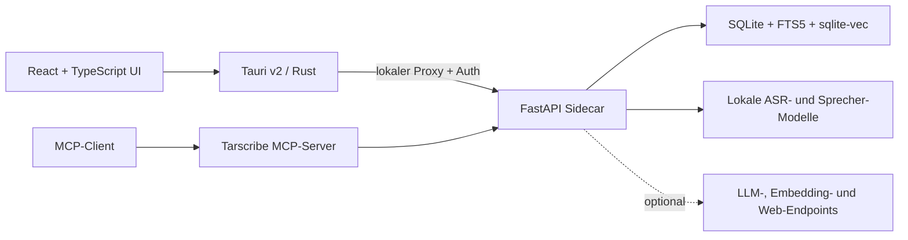

<p align="center">
  
</p>

<h1 align="center">Tarscribe</h1>

<p align="center">
  <strong>Aus Gesprächen wird belegbares Projektwissen.</strong><br>
  Lokale Aufnahme, Transkription, Sprechererkennung und ein Gedächtnis mit direkter Spur zurück zur Quelle.
</p>

<p align="center">
  <a href="https://github.com/valentinolabbate/Tarscribe/actions/workflows/ci.yml"></a>
  <a href="https://github.com/valentinolabbate/Tarscribe/releases/latest"></a>
  
  <a href="LICENSE"></a>
</p>

<p align="center">
  <a href="https://github.com/valentinolabbate/Tarscribe/releases/latest"><strong>Neueste Version herunterladen</strong></a>
  ·
  <a href="#installation">Installation</a>
  ·
  <a href="#entwicklung">Entwicklung</a>
</p>

---

Tarscribe ist eine lokale macOS-App für Meetings, Interviews, Vorlesungen und Sprachnotizen.
Sie nimmt Mikrofon und System-Audio auf, transkribiert auf Apple Silicon und verbindet
Transkripte, Entscheidungen, Aufgaben, Personen und Dokumente zu einem durchsuchbaren
Wissensarchiv.

Die zentrale Idee: Erkenntnisse sollen nicht nur generiert, sondern **über Zitate,
Zeitmarken und Aufnahmen überprüfbar** bleiben. Externe KI-Dienste sind optional und frei
konfigurierbar.

## Warum Tarscribe?

- **Local first:** Audio, Transkription, Sprecherverarbeitung und Datenbank bleiben auf dem Mac.
- **Belegbares Gedächtnis:** Aufgaben, Zusagen und Entscheidungen führen zurück zur Gesprächsstelle.
- **Offene Modellwahl:** Ollama, LM Studio, OpenAI, OpenRouter oder ein eigener
  OpenAI-kompatibler Endpoint — mehrere Verbindungen mit sicher hinterlegtem API-Key
  speichern und für Kapitel, Zusammenfassungen und Chat jeweils Verbindung und Modell wählen.
- **Mehr als ein Transkript:** Personenprofile, Themen-Threads, Wochen-Digests und
  projektweite Wissenssuche verbinden Gespräche über längere Zeit.
- **Bereit für Agenten:** Der integrierte MCP-Server macht Tarscribe für Codex, Claude und
  andere MCP-Clients nutzbar.

## Highlights

| Bereich | Funktionen |
| --- | --- |
| **Aufnahme** | Mikrofon, System-Audio oder beides; Live-Transkription; Dateiimport; Meeting-Erkennung; globales Diktat |
| **Transkription** | Lokale ASR-Modelle, Kapitel, Zeitmarken, Audio-Wiedergabe, Qualitätsprüfung und korrigierte Exporte |
| **Sprecher** | Diarisierung, Benennung, Zusammenführen, Stimmprofile und Sprecherstatistik |
| **Gedächtnis** | Commitment Radar, Decision Ledger, Aufgaben und quellenbasiertes Personengedächtnis |
| **Wissen** | Hybride Suche aus FTS5 und Vektoren, persistenter Chat, Dokumente und Themen-Threads |
| **KI-Auswertung** | Vorlagenbasierte Zusammenfassungen, Agentic RAG, optionale Webrecherche und sichtbare Quellen |
| **Automatisierung** | MCP-Server, Kalenderexport/CalDAV, Wochen-Digest, Ordnerexport und Auto-Updates |

## Das Gedächtnis

Der Bereich **Gedächtnis** bündelt projektweite Erkenntnisse in einer gemeinsamen
Unterseitenleiste:

| Unterseite | Aufgabe |
| --- | --- |
| **Commitment Radar** | Priorisiert offene, überfällige und noch zu prüfende Zusagen. |
| **Decision Ledger** | Führt aktuelle und ersetzte Beschlüsse mit ihrer Belegspur. |
| **Aufgaben** | Sammelt offene und erledigte Aufgaben aus allen Aufnahmen, filterbar nach Verantwortung, Frist und Themenbereich. |
| **Personen** | Verknüpft bekannte Sprecher mit gemeinsamen Gesprächen, Aufgaben, Entscheidungen und Themen-Threads. |
| **Archiv** | Bewahrt verworfene Erkennungen auf und ermöglicht ihre erneute Prüfung. |

Jeder geeignete Eintrag behält seine Belegspur mit Aufnahme, Originalzitat und Zeitmarke.
Ältere Aufgaben lassen sich nachträglich anreichern, ohne Text, Frist oder Fortschritt zu
überschreiben.

Die Startseite bündelt Aufnahme, Diktat, nächste offene Aufgaben und den letzten
Wiedereinstieg in einem „Heute“-Arbeitsplatz. Eine gemeinsame visuelle Quellenspur verbindet
Aufgaben, Entscheidungen und Personeninformationen direkt mit Aufnahme und Zeitmarke. Dieselbe
Spur führt im Meeting-Zeitstrahl, in Suchtreffern und in aufgeklappten Chat-Quellen zurück zur
belegenden Originalstelle. Aufgaben und Zusagen lassen sich dort direkt abschließen oder
zielgenau in ihrer passenden Gedächtnis-Unterseite öffnen. Kompakte Status- und Filterleisten halten Kennzahlen bedienbar,
während die eigentlichen Arbeitslisten als klare Hauptflächen im Vordergrund bleiben.

## Aufnahme und Verarbeitung

- Mikrofon und System-Audio einzeln oder gemeinsam aufnehmen
- Während der Aufnahme live transkribieren und Sprecher optional live trennen
- WAV, MP3, M4A, OGG, WebM, FLAC, AAC, MOV und MP4 importieren
- Aufnahmen automatisch in Kapitel gliedern
- Unsichere Wortstellen lokal prüfen, den Audiokontext hören und Korrekturen nicht-destruktiv übernehmen
- Korrigierte Schreibweisen einheitlich in Transkript, Sprecheransicht, Export, Suche und neuen KI-Auswertungen verwenden
- Sprecher erkennen, benennen, zusammenführen und als bekannte Stimme speichern
- Spontane Gedanken über einen konfigurierbaren globalen Diktat-Hotkey festhalten
- Optional laufende Konferenz-Apps erkennen und eine Aufnahme anbieten, wenn das Mikrofon
  tatsächlich verwendet wird

## Suche, Chat und Recherche

Tarscribe durchsucht Transkripte, Zusammenfassungen und Referenzdokumente gemeinsam. Die
hybride Suche kombiniert FTS5-Volltext mit semantischen Vektoren; Ergebnisse öffnen direkt
die relevante Quelle.

Für Kapitel, Zusammenfassungen, Aufgaben, Diktate, Digests und Chat kann **Agentic RAG**
aktiviert werden. Das Modell formuliert dann selbst Suchanfragen, bewertet Treffer und
recherchiert iterativ innerhalb des Wissensarchivs. Optional kann eine getrennt aktivierbare
Webrecherche aktuelle Quellen einbeziehen. Suchschritte und verwendete Quellen bleiben in der
Oberfläche sichtbar.

Unterstützte Referenzdokumente: PDF, DOCX, TXT, Markdown, HTML und EPUB.

## Installation

### Voraussetzungen

- Mac mit Apple Silicon (M1 oder neuer)
- macOS 12 oder neuer; System-Audio-Aufnahmen benötigen macOS 14.2 oder neuer
- Internet beim ersten Start für Runtime- und Modell-Downloads
- [`ffmpeg`](https://ffmpeg.org/) für Import, Normalisierung und Export

Falls `ffmpeg` fehlt:

```bash
brew install ffmpeg
```

### App installieren

1. Die aktuelle DMG unter [GitHub Releases](https://github.com/valentinolabbate/Tarscribe/releases/latest)
   herunterladen und öffnen.
2. In der DMG per Rechtsklick **`Tarscribe installieren.command` → Öffnen** wählen.
3. Den einmaligen Gatekeeper-Schritten folgen.

> [!IMPORTANT]
> Die veröffentlichten Builds sind ad-hoc signiert und derzeit nicht Apple-notarisiert.
> macOS verlangt deshalb bei der Erstinstallation mehrere Bestätigungen. Spätere signierte
> App-Updates laufen über den integrierten Updater ohne erneute Freigabe.

<details>
<summary><strong>Einmalige Gatekeeper-Freigabe Schritt für Schritt</strong></summary>

1. Nach dem ersten Öffnungsversuch **Systemeinstellungen → Datenschutz & Sicherheit** öffnen.
2. Beim Hinweis auf das blockierte Installationsskript **Trotzdem öffnen** wählen.
3. Das Installationsskript erneut öffnen. Es kopiert Tarscribe nach `/Programme` und startet
   die App.
4. Wenn macOS anschließend Tarscribe selbst blockiert, erneut unter
   **Datenschutz & Sicherheit → Trotzdem öffnen** freigeben.
5. Das Skript noch einmal öffnen und die Installation mit dem Admin-Passwort bestätigen.

Danach ist Tarscribe über Finder, Launchpad und Spotlight verfügbar.

Falls bereits die DMG als beschädigt gemeldet wird:

```bash
xattr -cr ~/Downloads/Tarscribe_*.dmg
```

</details>

Ausführliche Hinweise zur privaten Weitergabe stehen in [SHARING.md](SHARING.md).

## Erster Start

Der Einrichtungsassistent prüft das System und führt durch die optionalen Dienste:

1. Leistungsprofil für den Mac auswählen
2. Sprechererkennung und optionalen Hugging-Face-Zugang vorbereiten
3. Chat-Modell für Kapitel, Zusammenfassungen und Chat konfigurieren
4. Lokales Transkriptionsmodell herunterladen

Nach dem Download funktionieren Aufnahme, Transkription und lokale Verarbeitung offline.
Zusammenfassungen, Chat, Embeddings und Webrecherche benötigen nur dann Netzwerkzugriff, wenn
du dafür einen lokalen oder externen Endpoint konfigurierst.

## Typischer Workflow

1. Einen Themenbereich für ein Projekt, Seminar oder Interview anlegen.
2. Audio aufnehmen oder eine vorhandene Datei importieren.
3. Transkription starten; anschließend folgen Sprechererkennung und -zuordnung automatisch, bevor Aufgaben extrahiert werden.
4. In der Aufnahme Transkript, Meeting-Zeitstrahl, Zusammenfassung, Fragen und Sprecher prüfen.
5. Unter **Gedächtnis** offene Zusagen, Entscheidungen, Aufgaben und Personen weiterverfolgen.
6. Die gesamte Bibliothek durchsuchen, im Wissens-Chat befragen oder als Wochen-Digest bündeln.
7. Ergebnisse als TXT, SRT, VTT, JSON, PDF, WAV, Markdown oder Kalenderdatei exportieren.

## Agenten über MCP

Tarscribe enthält einen Model-Context-Protocol-Server. Unter
**Einstellungen → Agenten (MCP)** lässt er sich für unterstützte Hosts registrieren. Die
Tarscribe-App muss dabei laufen; der MCP-Server verbindet sich mit ihrem lokal geschützten
Backend.

Agenten können unter anderem:

- Themenbereiche, Aufnahmen, bekannte Sprecher und laufende Jobs abfragen
- Audiodateien hochladen und vollständige Verarbeitungspipelines starten
- Transkripte, Kapitel, Diarisierung und Zusammenfassungen lesen
- projektweit suchen und kompakten Aufnahmekontext abrufen
- Aufgaben auflisten und aktualisieren
- Zusammenfassungen aus Vorlagen erstellen und exportieren

## Datenschutz und Sicherheit

| Daten oder Funktion | Verhalten |
| --- | --- |
| **Audio und Transkripte** | Liegen im lokalen macOS-App-Datenverzeichnis. |
| **ASR und Diarisierung** | Laufen nach dem Modell-Download lokal auf dem Mac. |
| **Chat und Zusammenfassungen** | Verwenden ausschließlich den konfigurierten LLM-Endpoint; relevanter Kontext wird dorthin gesendet. |
| **Semantische Suche** | Nutzt den konfigurierten Embedding-Endpoint und speichert den Index lokal in SQLite. |
| **Webrecherche** | Ist pro Einsatzprofil optional und sendet nur bei Aktivierung Suchanfragen ins Web. |
| **Secrets** | Werden im macOS-Keychain gespeichert und nicht über die API zurückgegeben. |

Zusätzliche Schutzmaßnahmen:

- zufälliges Shared Secret zwischen Tauri-Shell und FastAPI-Sidecar
- Backend nur auf `127.0.0.1`, restriktive CORS-Regeln und Content Security Policy
- HTTP- und WebSocket-Zugriff der Desktop-App über einen Rust-Proxy
- validierte Upload-Endungen und begrenzte lokale Dateipfade
- separates, rotierendes Audit-Log mit defensiver Secret-Redaktion

Details und Prüfstand: [SECURITY_AUDIT.md](SECURITY_AUDIT.md).

## Architektur



```text
desktop/
  src/                 React-Oberfläche, Aufnahmefluss, Suche und Einstellungen
  src-tauri/           Rust-Shell, Sidecar, Tray, Autostart und native Audioaufnahme

backend/
  tarscribe_backend/   FastAPI, Jobs, ML, RAG, Exporte und MCP
  tests/               Backend-, Journey- und Security-Tests
```

Die Tauri-Shell startet das Python-Backend auf einem zufälligen lokalen Port mit einem
zufälligen Token. Daten und Suchindex liegen als SQLite-Datenbank plus Audiodateien im
App-Datenverzeichnis.

## Entwicklung

### Voraussetzungen

- macOS auf Apple Silicon
- Node.js 22
- Rust über [`rustup`](https://rustup.rs/)
- Python 3.11 oder 3.12
- [`uv`](https://docs.astral.sh/uv/)
- `ffmpeg`

### Repository einrichten

```bash
git clone https://github.com/valentinolabbate/Tarscribe.git
cd Tarscribe

cd backend
uv sync --all-extras

cd ../desktop
npm ci
```

### Desktop-App starten

```bash
cd desktop
npm run tauri dev
```

### Frontend im Browser starten

```bash
# Terminal 1
cd backend
TARSCRIBE_AUTH_TOKEN="" .venv/bin/python -m uvicorn tarscribe_backend.main:app --port 8765

# Terminal 2
cd desktop
npm run dev
```

Die Browser-Oberfläche läuft unter `http://localhost:1420`. Für andere Dev-Origins muss
`TARSCRIBE_ALLOWED_ORIGINS` passend gesetzt werden.

### Tests

```bash
# Backend
cd backend
.venv/bin/python -m pytest
.venv/bin/python -m ruff check .

# Frontend
cd ../desktop
npm test
npm run build

# Rust
cd src-tauri
cargo check --locked
```

Die CI führt Backend-Tests und Lint, Frontend-Build sowie `cargo check` auf macOS aus.

## Mitwirken

Fehlerberichte und konkrete Verbesserungsvorschläge sind über
[GitHub Issues](https://github.com/valentinolabbate/Tarscribe/issues) willkommen. Vor einem
Pull Request bitte die für den betroffenen Bereich relevanten Tests ausführen.

## Weitere Dokumentation

- [SHARING.md](SHARING.md) – private Weitergabe ohne Apple Developer ID
- [RELEASING.md](RELEASING.md) – Release- und Auto-Update-Prozess
- [SECURITY_AUDIT.md](SECURITY_AUDIT.md) – Sicherheitsarchitektur und Audit-Stand
- [AGENTS.md](AGENTS.md) – Konventionen für Entwicklungsagenten

## Lizenz

Tarscribe steht unter der [MIT-Lizenz](LICENSE).
